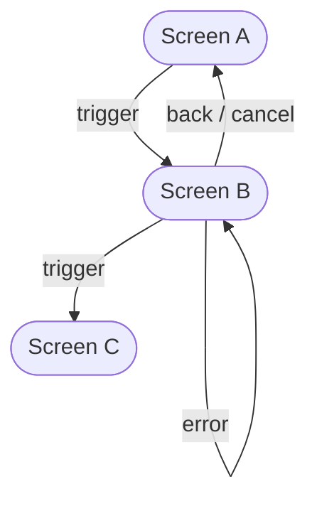

# Section Pack: Screen Flow

> **Insert into**: Technical Contract [TC-SF]
> **When**: Any feature with multiple screens, pages, or steps.

### Screen Flow

> **GUIDE**
> **What**: A Mermaid flowchart showing how screens connect — transitions, triggers, and error/back paths.
> **Why**: Without a flow diagram, the reader must mentally reconstruct the screen sequence from scattered ACs.
> **How**:
> - Use Mermaid `flowchart TD` (top-down) syntax. Do not use ASCII art.
> - Show: screens as rounded boxes `([Screen Name])`, transitions as labeled arrows `-->|trigger|`
> - Include: happy path, error paths, back/cancel paths, conditional branches
> - After the diagram, add a "Key differences from current behavior" bullet list if this modifies an existing flow.

