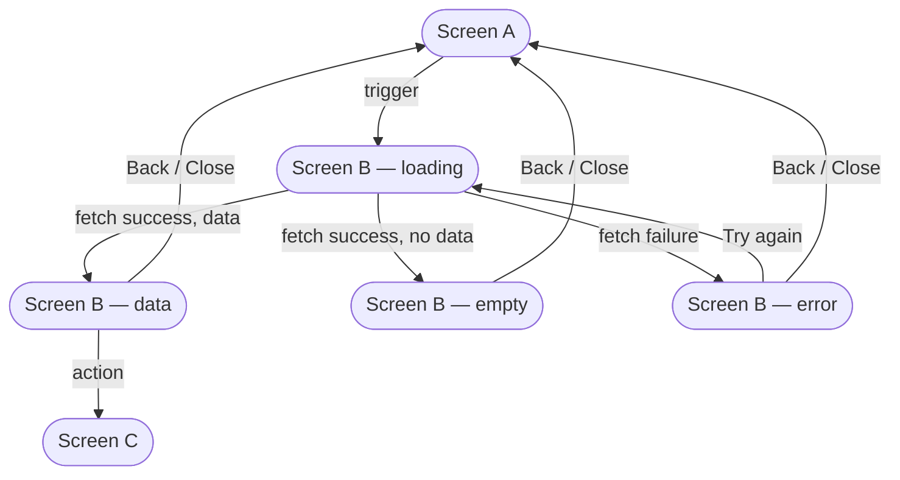

# Section Pack: Screen Flow

> **Insert into**: Technical Contract [position: 3] (`full` mode) / Behavioral Contract — after Edge Cases [position: 4] (`slim` mode)
> **When**: Any feature with multiple screens, pages, or steps.

### Screen Flow

> **GUIDE**
> **What**: A Mermaid flowchart showing every state the user can be in and every transition between states.
> **Why**: Without a flow diagram, the reader has to rebuild the state machine in their head from scattered ACs. An AI coding agent uses this diagram to implement navigation and state management — a missing node becomes a missing code path.
> **Derived view — the contract wins**: The diagram is a **derived view** of the FRs, ACs, and edge cases it cites — never a second source of truth. When diagram and contract disagree, the contract wins and the diagram is the defect. Regenerate the diagram from the contract after any change to states, transitions, or gates; never edit behavior into the diagram first.
> **How**:
> - Use Mermaid `flowchart TD` (top-down) syntax. Do not use ASCII art.
> - Show: states as rounded boxes `([State Name])`, transitions as labeled arrows `-->|trigger|`, decision points as diamonds `{condition}`
>
> **Required node types** — every diagram must model these as distinct nodes (not self-loops) when the PRD has ACs for them:
> - **Loading states**: Initial fetch shows a skeleton or placeholder — this is a distinct node, not an implicit transition. If the screen has a background refetch that can fail independently, model that as a separate node too.
> - **Error states**: Fetch failure, validation failure, and submission failure are distinct states with their own exit edges (retry, back, close).
> - **Empty states**: "No data" and "no search results" are different states with different exits. Model each as its own node.
>
> **Required edges** — every diagram must include:
> - **Exit edges from every terminal state**: If the user can tap Back or Close from an error state or empty state, show that edge explicitly. Do not assume the reader will guess that navigation is available from error and empty states.
> - **Retry edges go to loading, not to data**: Error → Try again → Loading (skeleton) → Success/Failure. Never draw error → data directly.
> - **Back/close/leave edges**: From every state where the user can navigate away.
>
> **Sub-state decomposition**: When a single screen has multiple internal states visible to the user (e.g., a form with in-flight validation, inline errors, conditional sections appearing/disappearing), split it into sub-state nodes instead of collapsing everything into one node with self-loops. The test: if two ACs describe different things on screen, they are different states.
>
> **Completeness check**: After drawing the diagram, scan every AC that describes a state transition (loading → loaded, error → retry, empty → back). Each must have a corresponding edge in the diagram. If an AC's transition is not in the diagram, either add the edge or document why it's omitted (e.g., global behavior owned by a shared requirement).
>
> After the diagram, add a "Key differences from current behavior" bullet list if this modifies an existing flow.

```mermaid
flowchart TD
    A([Screen A]) -->|trigger| B([Screen B — loading])
    B -->|fetch success, data| C([Screen B — data])
    B -->|fetch success, no data| D([Screen B — empty])
    B -->|fetch failure| E([Screen B — error])
    E -->|Try again| B
    C -->|action| F([Screen C])
    C -->|Back / Close| A
    D -->|Back / Close| A
    E -->|Back / Close| A
```
